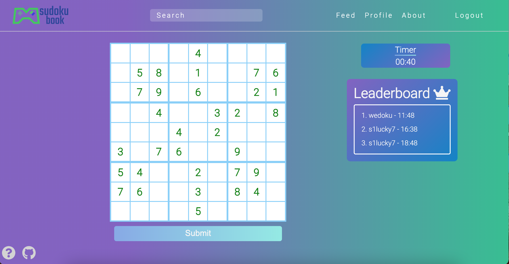
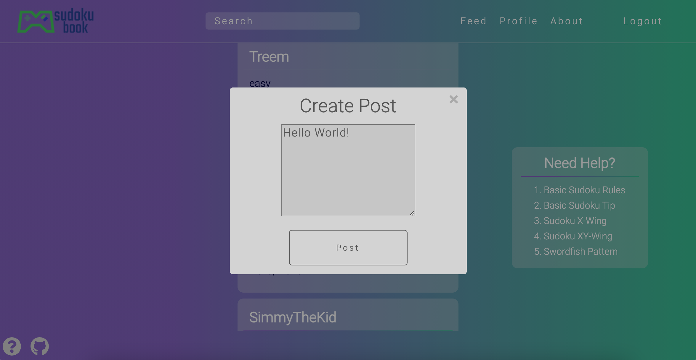
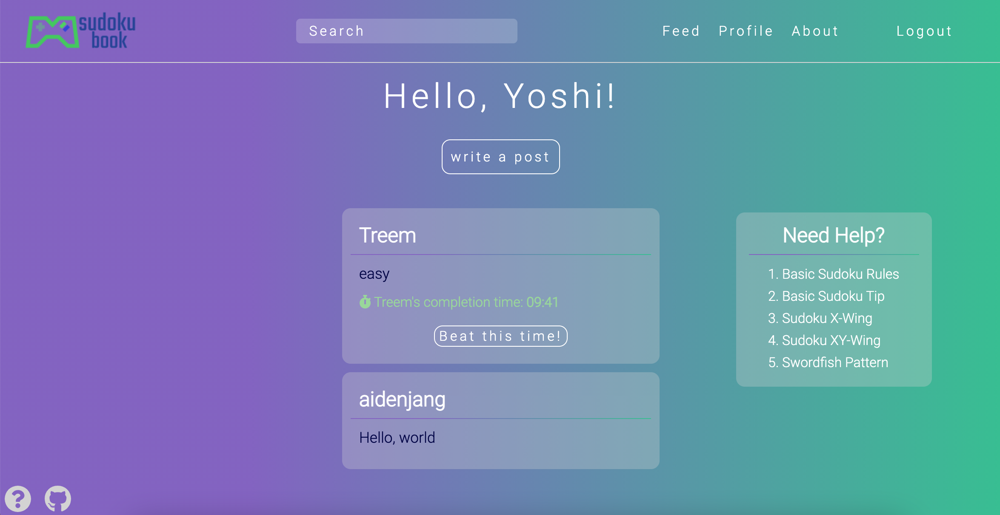

# Introduction
Link: [SudokuBook](https://sudoku-book.herokuapp.com/)

SudokuBook is a sudoku-based social networking application. SudokuBook's core features include:
- Filling out sudoku puzzles 
- Saving puzzle completion times
- Posting completion times and messages to a live social feed
- User authentication
- Creating, Reading, Updating, and Deleting posts
- Adding friends
- User profiles

# Technologies Used
This application was developed using the following technologies: 
- MongoDB
- Express.js
- React
- Redux 
- Node.js 

# How to
SudokuBook is simple to use and mirrors any other social media application. 
1. Sign up or log in (feel free to use the demo user account)
2. Play a random puzzle from the home page or scroll through the social feed to accept another user's challenge
3. Fill out a puzzle and keep an eye on the timer
4. Post your completion time with a message to challenge others
5. Add friends by searching for them using the search bar
6. You can also post messages to the social feed without having to complete a puzzle 
7. Edit or delete your posts 

# Key Functionality 
## Play Sudoku
Users can fill out puzzles and post completion times. Completion times are added to that puzzles leaderboard if the user is in the top 5! 

## Posts
Users can write messages to post to the social feed. After completing a puzzle, users will be prompted to write a message tied to their completion time to post to the feed. However, users can still post to the feed without having to complete a puzzle. Users have the ability to edit and delete their own posts. 

## Social Feed
All users have access to the social feed. This is where a user can see all other users' posts and accept any challenges. This is also where users can find their own posts and edit/delete them. 

## Profile and Friends
Each user has a profile. A profile will show a user's posts and friends. Users can search for friends through the search bar located at the top of the screen and add friends through their profiles. Users may also delete friends from their friends list. 

